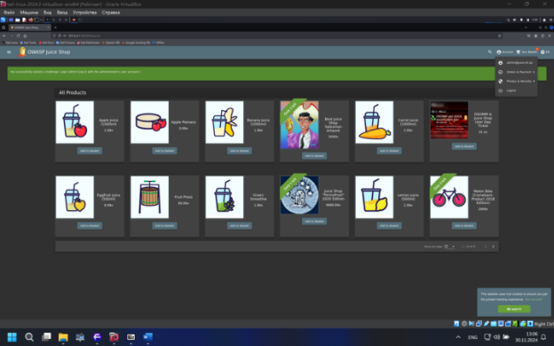
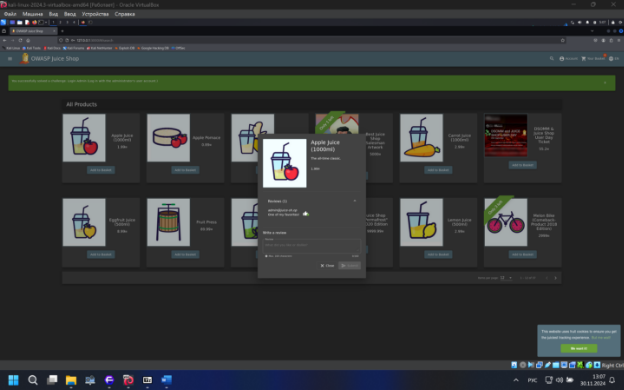
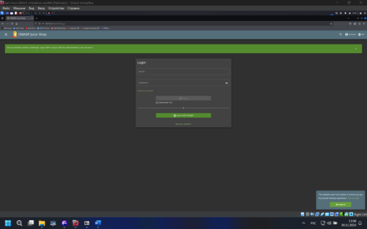
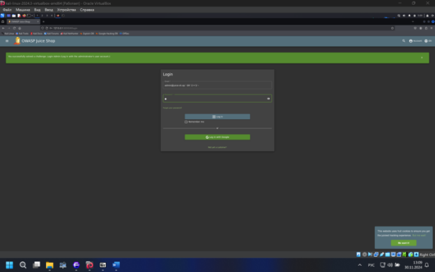
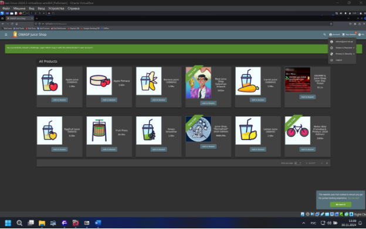



Открываем любой товар, смотри, где можно найти какую-нибудь зацепку

Видим, есть комент с почтой админа, берем ее, пригодится для входа

Как мы видим, для входа испрльзуется почта

А почта у нас есть [*admin@juice-sh.op*](mailto:admin@juice-sh.op)

Путем простой sql injection попробуем войти в аккаунт

И как мы видим,мы успешно вошли в аккаунт

1. Использованные для ввода данные.
1. Под каким пользователем вам удалось войти.
1. Ваши предположения, почему удалось войти именно под этим пользователем.
1. Где хранится аутентификационная информация, что она из себя представляет и как передаётся в каждом запросе.

Ответы
1  в поле логина ввели [*admin@juice-sh.op](mailto:admin@juice-sh.op) *' OR '1'='1'—* , а пароль любой символ

2\. под пользователем админа

3\. SQL Injection нарушил проверку пароля, а SQL-запрос вернул первую запись в таблице пользователей.

4\. Хранится в **JWT-токене** (localStorage или cookies).

Представляет собой токен с данными о пользователе (например, email, роль, время действия).

Передаётся в каждом запросе через заголовок Authorization
